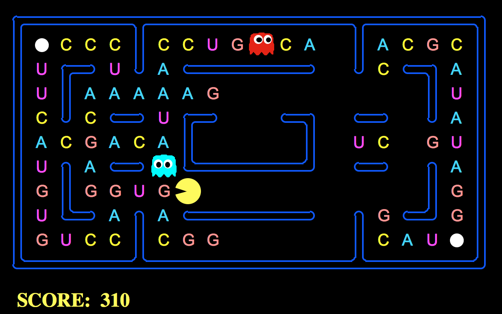

# DNAPacManHMM

The DNA Pac-Man game (https://github.com/HussainAther/dnapacman) can represent how protein sequences are generated (using Hidden Markov Models). We can draw an analogy of how HMMs work in the context of generating protein sequences using the Pac-Man. The next token/letter you eat is the next letter in the sequence of generating a sequence of protein amino acids. 

Essentially, if we organize regions of the Pac-Man board representing different hidden states in a Markov Model, then the next letter that Pac-Man eats can represent the next state an HMM selects. We can change the probabilities a certain letter may appear and, when Pac-Man enters the hidden state, then the probabilities would change. 

We can observe how the probability for different states changes as people play based on which letter they choose next. We can compare the HMM of Pac-Man to the HMMs in modeling eukaryotic genes following the methods of this manuscript "Hidden Markov Models and their Applications in Biological Sequence Analysis": https://www.ncbi.nlm.nih.gov/pmc/articles/PMC2766791/

## What are HMMs?

HMMs are methods of statistical representation for modelling one-dimensional discrete symbol data. We can use them to describe how observable events that depend on internal unobservable factors evolve over time. The "symbol" is the observed event, and the "state" is the invisible factor underlying the observation. They use two stochastic processes: an invisible process of hidden states and a visible processs of obesrvable symbols. The hidden states, then, form a Markov chain with a probability distribution of the observed symbol depending on the underlying ststate. 

## How do HMMs relate to protein sequences? 

In biology, scientists use HMMs to model protein sequences depending on how they're represented by the Markov states. This makes them applicable for solving problems like protein structure prediction. the states can be homologous sequence posiitions, local or secondary structure types, or transmembrane locality. The models can be used for predicting common anecstry, secondary, or local structure.    

For protein structure prediction, states have been chosen to represent either homologous sequence positions, local or secondary structure types, or transmembrane locality. The resulting models can be used to predict common ancestry, secondary or local structure, or membrane topology by applying a standard algorithm for comparing a sequence to a model. For biological sequences of proteins or DNA sequences, we can break a sequence of letters (ACUG for RNA bases or ACTG for DNA bases) down to smaller substructures with different functions. The functional regions themselves would have different statistical properties. The constituting domains of a protein would correspond to the states in an HMM while their locations in the amino acid sequences would be the observations.   

## Ok, but what the hell does Pac-Man have to do with this?

Ahh, good question! When playing the DNA Pac-Man game, we need to eat RNA bases to create strings of amino acids and proteins in the dark, scary maze of the Pac-Man board while avoiding the ghosts. But, when playing DNA Pac-Man, you can't just choose which RNA bases to eat willy-nilly. You're constrained or confined to the few bases you have that are open to you at any given moment. This creates a similar constraint or set of options that an HMM would have in figuring out which state the Pac-Man must choose to create a protein sequence.  

There are three types of HMMs that could fit in representing DNA Pac-Man:  
* Profile-HMMs
* Pair-HMMs
* Context-sensitive HMMs

## Profile-HMMs

Let us assume that we have a multiple sequence alignment of proteins or DNA sequences that belong to the same functional family. How can we build an HMM that can effectively represent the common patterns, motifs, and other statistical properties in the given alignment? One model that is especially useful for representing the profile of a multiple sequence alignment is the profile hidden Markov model (profile-HMM). Profile-HMMs are HMMs with a specific architecture that is suitable for modeling sequence profiles. Unlike general HMMs, profile-HMMs have a strictly linear left-to-right structure that does not contain any cycles. A profile-HMM repetitively uses three types of hidden states, namely, match states Mk, insert states Ik, and delete states Dk, to describe position-specific symbol frequencies, symbol insertions, and symbol deletions, respectively.

## Pair-HMMs

## Context-sensitive HMMs

## 

## Post-project

After modifying Pac-Man and writing the project, I plan on pitching the article to WIRED titled “How Pac-Man can Predict Proteins.” 
